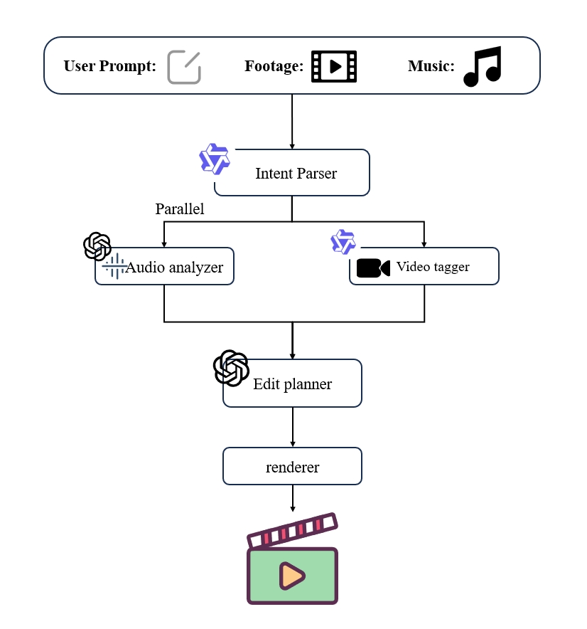
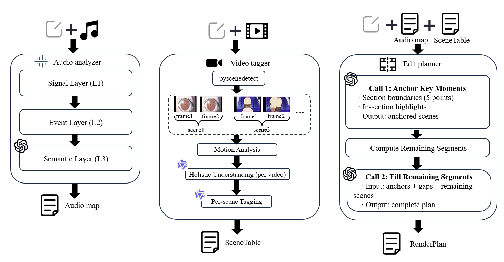

# Motif

**Let music edit your videos.**

> Feed it a song + a pile of video clips, get a beat-synced remix back.

<p align="center">
    
    
    
    
    
  </p>

  <p align="center">
    <a href="#demo">Demo</a> ·
    <a href="#architecture">Architecture</a> ·
    <a href="#quick-start">Quick Start</a>
  </p>
---

## ✨ What It Does

Given a music track + a set of video clips, Motif automatically produces a **beat-synced, emotion-aligned** video remix.

Any footage works:
- Anime AMV
- Film / TV series mashups
- Concert & stage recordings
- Personal vlogs & travel footage

Upload music and videos, and the system handles everything: beat analysis → scene understanding → shot planning → transition rendering. One command, one output.

---


 ## 🎬 Demo  🔊 turn on audio

  **Music**: SawanoHiroyuki[nZk] — *GravityWall* | **Footage**: Fate/stay night

  https://github.com/user-attachments/assets/acdcd21b-1867-40be-80e5-e3ed08c2b40c


 **Music**: KIVΛ — *Used to be* (Cytus II) | **Footage**: BLAME! × Cytus II CG

  https://github.com/user-attachments/assets/f351ab4c-92b9-43a2-aa85-5874f4256ffe


---

## 🏗 Architecture <a id="architecture"></a>

### Overview



The system chains **5 modules**, with audio analysis and video analysis running in parallel:

| Module | Role | Uses LLM |
|--------|------|:---------:|
| **Intent Parser** | Parse user text input, match to footage files | ✅ Qwen |
| **Audio Analyzer** | Three-layer audio analysis (signal → event → semantic) | ✅ GPT-5.5 |
| **Video Tagger** | Scene segmentation + multimodal annotation | ✅ Qwen-VL |
| **Edit Planner** | Plan shot sequence + transitions + speed changes | ✅ GPT-5.5 |
| **Renderer** | FFmpeg final composition | — |

### Module Details



**Audio Analyzer (three layers)**
- **Signal Layer (L1)**: All-In-One structure segmentation + Demucs stem separation + librosa beat/energy extraction
- **Event Layer (L2)**: Candidate scoring + adaptive thresholding → rhythmic anchor points + pacing hints
- **Semantic Layer (L3)**: GPT-5.5 semantic enrichment (mood, VAD, narrative arc)

**Video Tagger**
- PySceneDetect scene segmentation + keyframe extraction
- OpenCV optical flow → objective motion_intensity
- Qwen-VL holistic video understanding (once per source video)
- Qwen-VL per-scene tagging (mood / description / VAD)

**Edit Planner (v5)**
- **Call 1 — Anchor Key Moments**: Select scenes for section boundaries and in-section highlights
- **Compute Remaining Segments**: Calculate unfilled time intervals
- **Call 2 — Fill Remaining Segments**: Fill each gap with transition footage

---

## 🧠 Planner Evolution: From ≈$5 to ≈$0.25

The Edit Planner went through 5 architecture iterations — each answering: **"What should algorithms handle vs. what should the LLM decide?"**

| Version | Architecture | Cost | Duration | Result |
|---------|-------------|------|----------|--------|
| v1 | Global ReAct (80 iterations) | ≈$5 | Slow | Context explosion, 76% coverage |
| v2 | GPT global + Qwen local fill | ≈$1.5 | Medium | Smaller model drifts off |
| v3 | GPT Stage 1 + Beam Search | ≈$0.15 | 40s | Fast but rigid, no aesthetics |
| v4 | GPT global + per-segment ReAct | ≈$2-3 | 15min | Balanced but expensive |
| **v5** | **Full scene metadata in context + two-call layered planning** | **≈$0.25** | **≈2min** | **Final approach** |

**The v5 breakthrough**: Instead of using queries to retrieve top-K scenes for the LLM, we feed **all scene metadata directly into context**. With GPT-5.5's 1M context window, even large footage libraries fit easily — **zero retrieval loss, global decision-making in one shot**.

---

## 💡 Design Rationale

### Audio: Why Three Layers Instead of Letting AI Listen Directly

The naive approach: **let a multimodal model listen to the music and output segments, anchors, and moods in one pass**.

Two fatal problems emerged in practice:

1. **Output granularity too coarse**: The model produces qualitative descriptions like "overall sad atmosphere" or "climax in the middle" — not the "strong drum hit at 58.3s" that beat-synced editing actually needs
2. **Timestamps are hallucinated**: Reported time points are off by 1-2 seconds or completely fabricated. For beat-synced editing, **millisecond precision is non-negotiable**

Natural improvement: **use algorithmic tools (librosa / Demucs / All-In-One) for precise beat, onset, and segment boundary detection** — these produce objectively accurate timestamps.

But a new problem: **even with 39 precise timestamps, the AI can't reliably judge which ones matter most** — LLMs have weak temporal perception. Distinguishing "importance 0.58 vs 0.48" is not something they do well.

**Final architecture: algorithms handle precision, LLMs handle understanding**

| Layer | Tool | Responsibility |
|-------|------|---------------|
| L1 | librosa + Demucs + All-In-One | Precise beats, segments, onsets (objective data) |
| L2 | Adaptive threshold algorithm | Filter hundreds of onset candidates down to true anchors (dimensionality reduction) |
| L3 | GPT-5.5 | Add mood labels, narrative arc (subjective understanding) |

The division principle: **don't let LLMs guess what can be computed; don't hardcode what requires understanding.**

### Video: Why Scene Detection + Optical Flow Instead of Feeding Everything to a Multimodal Model

The same pitfalls from audio apply to video.

The naive approach: **feed the entire video to GPT-5.5 / Qwen-VL and ask it to describe each segment**.

Same two problems:

1. **Temporal perception remains weak**: The model understands "what's happening" but can't pinpoint "this sword draw happens at 30.3s in the source" — the millisecond-level localization that editing demands
2. **Granularity too coarse**: A 10-minute video may contain 50 distinct scenes, but the model only produces a few summary sentences — editing needs **scene-level** semantic labels

The natural solution: specialized tools for fine-grained processing:

- **PySceneDetect**: Pixel-difference algorithms for precise scene boundary detection with millisecond timestamps
- **OpenCV optical flow**: Objective motion_intensity computation (0~1) per scene — far more stable than LLM-based scoring

After algorithms segment and quantify the video, multimodal models do what they're good at:

- **Qwen-VL holistic understanding** (once per source video): Grasp the overall narrative as context for per-scene tagging
- **Qwen-VL per-scene tagging**: Output mood / description / VAD for each individual scene

**Final architecture**:

| Layer | Tool | Responsibility |
|-------|------|---------------|
| Scene segmentation | PySceneDetect | Objective boundaries (precise timestamps) |
| Motion analysis | OpenCV optical flow | Objective action intensity |
| Holistic understanding | Qwen-VL | Full-video narrative context |
| Scene tagging | Qwen-VL | Scene-level semantics + mood |

Same design philosophy as audio: **algorithms handle "where / how strong", LLMs handle "what / how it feels".**

### Edit Planning: Making AI Mimic a Human Editor's Workflow

Using Aimer's "Brave Shine (TV size)" as an example, audio analysis yields this structure:

```
intro   [0.00  ~ 17.21]
verse   [17.21 ~ 39.67]
verse   [39.67 ~ 56.51]
chorus  [56.51 ~ 88.78]    ← peak intensity
end     [88.78 ~ 91.36]
```

A human editor using Premiere Pro would likely **first lock down the section transition points** (0.0 / 17.21 / 39.67 / 56.51 / 88.78 / 91.36), deciding what key visuals go at each — opening sets the tone, verse→chorus needs an explosion, ending needs resolution. This is the skeleton.

Then handle **in-section key beat points** (key moments) — e.g., at 5.97s in the intro there's an importance=0.58 drum hit that must align with a character's action moment.

Finally, **fill the gaps with transitional footage**, following the segment's emotional baseline and narrative logic.

This naturally leads to a **divide-and-conquer three-layer structure**:

| Layer | Meaning | Decision Priority |
|-------|---------|-------------------|
| **L1** | Section boundaries | Skeleton, highest priority |
| **L2** | High-importance in-section anchors | Emotional highlights, second priority |
| **L3** | Remaining intervals after L1/L2 | Fill with transitional footage |

### Key Design Decisions

**1. L1 claims first, L2 selects from the remainder**

If L1 and L2 select simultaneously, conflicts arise — e.g., 56.51s is both a section boundary AND the highest-importance anchor. Both want to claim it.

**Solution**: L1 claims first, creating "exclusion zones". L2 can only select from outside these zones. Essentially timeline subtraction:

```
Total timeline − L1 occupied = remaining after L1
remaining ∩ key_moments = L2 candidates
L2 filtered → L2 occupied
remaining − L2 = final gaps for L3
```

This architecture is **isomorphic to memory allocation** — L1/L2/L3 are priority-ordered memory blocks, gaps are fragmentation.

**2. Special handling for start/end, midpoint alignment for middle points**

L1 claim durations can't be uniform:
- **Opening** (0.0s): Must start from 0, duration follows natural entry point (≈3.5s)
- **Ending** (91.36s): Must cover until song ends
- **Middle boundaries** (17.21 etc.): Split evenly before/after (1.0~1.5s), scene midpoint aligned to music anchor time

**3. Fragment defragmentation: shift by priority**

After L2 midpoint alignment, adjacent claimed intervals may produce <1s fragments (too short for any shot).

**Strategy C** (final approach):
- Gap < 0.5s: Extend adjacent block to absorb it
- 0.5s ≤ Gap < 1.0s: Shift lower-priority block to adjoin higher-priority block
- Gap ≥ 1.0s: Keep for L3

**4. Narrative continuity: preventing "crying one second, battle the next"**

The biggest risk of divide-and-conquer is **each layer independently selecting scenes that create emotional whiplash**. The solution: have Stage 1 (GPT-5.5) **explicitly describe the emotional trajectory between segments** — not describing each segment in isolation, but specifying how "intro → verse should transition."

### Why v5 Won: Full Scene Metadata Directly to LLM

Earlier versions (v1~v4) all fought against "context limitations":
- CLIP retrieval of top-K for LLM (but queries are lossy compression)
- ReAct multi-turn dialogue (but context grows unboundedly)
- Algorithmic scene selection + LLM planning (but algorithms lack aesthetics)

Until realizing: **GPT-5.5 has 1M context, and a complete scene_table typically fits in 20-30K tokens**. Why bother with retrieval at all?

v5 feeds all scene metadata directly to the LLM in two calls:
1. **Call 1**: Anchor L1/L2 key scenes
2. **Call 2**: Fill L3 remaining gaps

**Two calls total, ≈$0.25 cost, ≈2 minutes, best results** — because the LLM is no longer limited by query expressiveness and can freely choose the most fitting shots from the entire library.

This validates a broader principle: **when context is large enough, retrieval becomes an information loss source.**

---

## 🔧 Engineering Challenges & Solutions

### 1. Frame Rate Rounding Causes Cumulative Time Drift

Source videos at 30fps → output forced to 24fps. FFmpeg writes 1-2 extra frames per clip; across 37 clips this accumulates to **+1.97 seconds** (the entire video drifts half a beat behind the music).

**Fix**: Use `-frames:v N` to explicitly specify output frame count, where N = audio duration × 24. Cumulative drift reduced from +1970ms to **0ms**.

### 2. Large Single Video Causes OOM

A single 165MB / 10min video × concurrent scene analysis × optical flow computation × Qwen-VL upload → memory peak explodes, triggering Windows page file exhaustion.

**Fix**: Preprocessing stage automatically splits large videos into ≤3 minute segments, each processed independently. Peak memory reduced from ~8GB to ~1.5GB, concurrent pressure reduced 5×.

### 3. FFmpeg Filter Timeline Compatibility

`crop` / `scale` filters don't support the `enable` timeline switch (only `hue` / `gblur` / `fade` and similar filters do). Initial implementation of "0.2s shake then reset" transition effects failed silently.

**Fix**: Handle by filter type — use `enable` switch for Timeline-supported filters; use full-clip persistent effects for others. Failure rate reduced from ~10% to 0%.

---

## 🚀 Quick Start <a id="quick-start"></a>

### Environment

```bash
conda create -n motif python=3.11 -y
conda activate motif
pip install -r requirements.txt
```

FFmpeg must also be installed and available in PATH.

### Configuration

Copy `.env.example` to `.env` and fill in your API keys:

```env
OPENAI_KEY=sk-...          # GPT-5.5 (audio semantics + planner)
DASHSCOPE_API_KEY=sk-...   # Qwen-VL (video understanding) + Qwen (intent parsing)
```

### Usage

All functionality is accessed through the unified entry point `motif.py`:

#### Web UI

```bash
python motif.py ui
```

Open `http://localhost:6006`, upload music + video clips + optional text prompt → one-click output.

#### CLI

```bash
python motif.py run \
    --music your_song.mp3 \
    --videos your_videos/ \
    --background "Fate AMV, melancholic first half, explosive chorus"
```

`--background` accepts free-form text — footage context, editing intent, style preferences all work (optional).

#### Render Only (skip planning, reuse existing plan)

```bash
python motif.py render-only --music your_song.mp3
```

Run `python motif.py -h` for full parameter reference.

---

## 📁 Project Structure

```
motif/
├── motif.py               # Unified entry point (ui / run / render-only)
├── server.py              # Gradio Web UI implementation
│
├── agents/                # Intent Parser / Planner Tools
├── audio/                 # Three-layer audio analysis
├── video/                 # Scene detection + multimodal annotation
├── planner/               # Edit Planner v5 core
├── pipeline/              # LangGraph orchestration + FFmpeg rendering
├── models/                # Pydantic data models
├── prompts/               # Agent system prompts
└── utils/                 # Shared utilities
```

---

## ⚠️ Known Limitations

- **Planning quality ≤ tagging quality**: If Qwen-VL misdescribes a scene, GPT-5.5 will select it based on wrong information
- **Section transitions can feel abrupt**: Visual continuity at L1 boundaries relies on LLM judgment — occasionally produces jarring cuts (e.g., "raising sword → suddenly meditating")
- **Footage quantity affects decision quality**: Too few scenes limits LLM choices; too many (>200 scenes) approaches context limits
- **Large file memory pressure**: Single videos ≥10 minutes require manual pre-splitting (or automatic segmentation by the system)

---

## 📜 Acknowledgments

- **DIRECT-Claw** paper (three-stage Screenwriter / Director / Editor architecture inspiration)
- **LangGraph** (state machine orchestration)
- **All-In-One / Demucs / librosa / PySceneDetect**

---

## License

MIT
